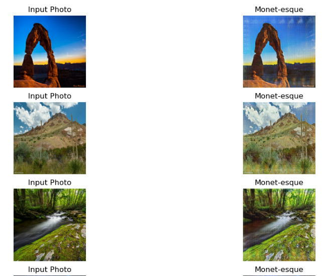

# art_creation
GAN in art creation

## Introduction:
A GAN consists of at least two neural networks: a generator model and a discriminator model. The generator is a neural network that creates the images. For our competition, you should generate images in the style of Monet. This generator is trained using a discriminator.

The two models will work against each other, with the generator trying to trick the discriminator, and the discriminator trying to accurately classify the real vs. generated images.

Your task is to build a GAN that generates 7,000 to 10,000 Monet-style images.

## Data

photo images 

monet style images

These features can be used and analyzed with appropriate statistical and machine learning techniques and can help in predicting an individual's medical costs.
## Modeling

## Future Directions
this repo employed a Graph Neural Network (GNN) model with the objective of transforming regular photographs into images mirroring the unique style of the eminent artist, Claude Monet. Our architecture is fundamentally rooted in the Generative Adversarial Network (GAN) framework, consisting of two primary components: a discriminator and a generator.

Generator: The generator demonstrated ability in assimilating Monet's style. Pressumably, during the initial epochs, the generated images bore only faint resemblances to Monet's style. However, as training progressed, the generator began creating more nuanced textures and patterns closely mirroring those found in Monet's original works.

Discriminator: The discriminator's function was to discern between actual Monet paintings and the images generated by our model. Over epochs, it exhibited increasing difficulty in differentiating between the two, suggesting the generator's growing proficiency in replicating Monet's style. GNN-based model showcases significant potential in the domain of art generation, offering a novel approach to style transfer.he combination of a generator and discriminator within the GAN framework allowed for an iterative refinement of the generated images